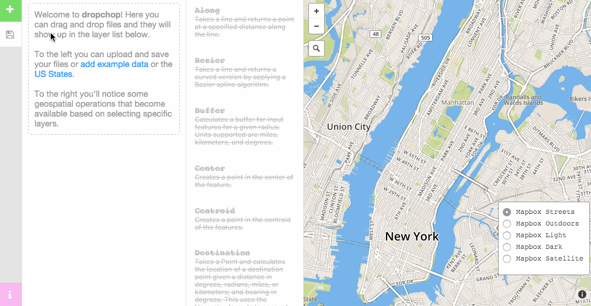
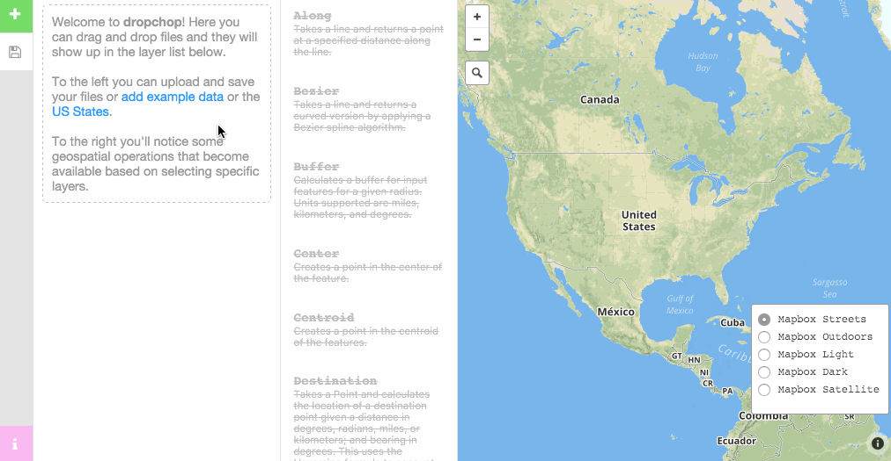
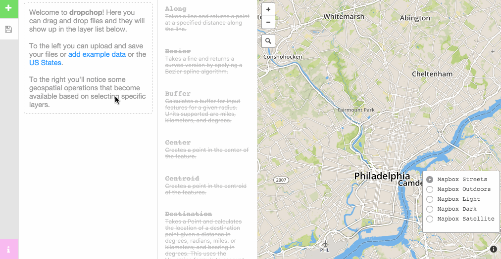
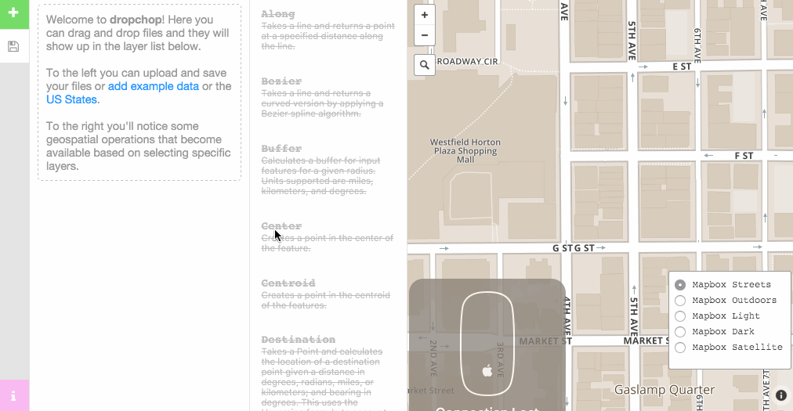
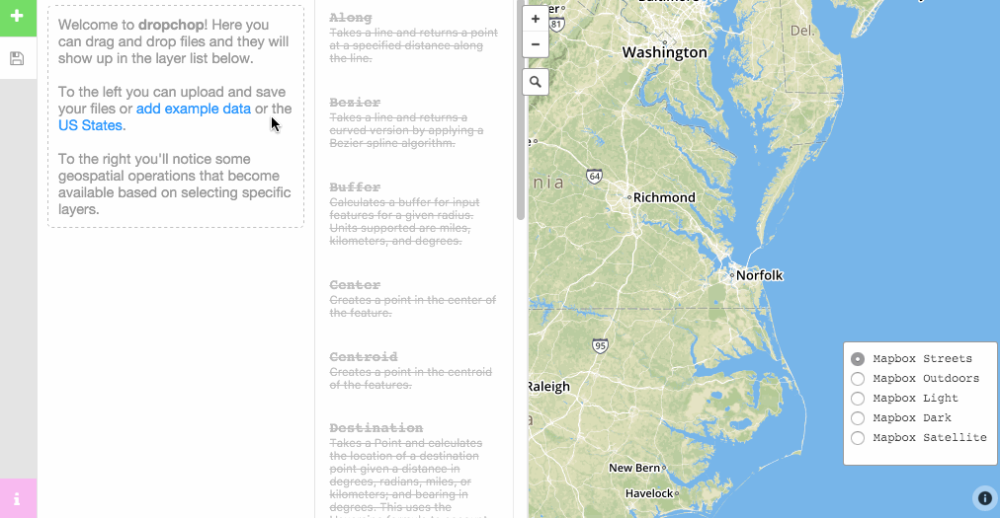
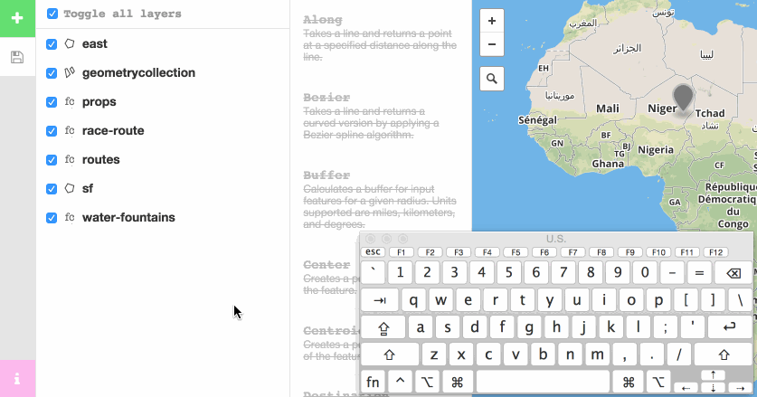
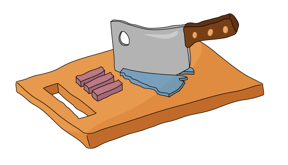

# dropchop
 

**You drop. We chop.**

Dropchop is a browser-based GIS powered by [Mapbox.js](http://mapbox.com/mapbox.js) and [Turf.js](http://turfjs.org). The need for small-scale GIS operations comes up quite frequently in our work, especially for those without much time. Dropchop aims to empower your spatial data by removing complexity. This project is currently a proof-of-concept and explores [three hypotheses](https://github.com/cugos/dropchop/wiki/Dropchop-Inspiration):

1. **GIS can be data-first, not operation-first.**
2. **GIS doesn't always require a server.**
3. **GIS is open.**

## User's Manual

* [Adding Data](#adding-data)
    * [Upload](#upload)
    * [URL](#url)
    * [Gist](#gist)
    * [Open Street Map](#open-street-map)
    * [ArcGIS Server Feature Service](#arcgis-server-feature-service)
    * [User Location](#user-location)
* [Exporting Data](#exporting-data)
    * [GeoJSON](#geojson)
    * [TopoJSON](#topojson)
    * [Shapefile](#shapefile)
* [Keyboard Shortcuts](#keyboard-shortcuts)

### Adding Data

Dropchop provides several ways to add data. Outlined below are examples of these methods.

#### Upload

You can upload your own files via *click-and-drag* or *selecting files on your computer* using the system dialogue. File types allowed are `.json` (assuming valid TopoJSON or GeoJSON), `.geojson`, `.topojson`, Shapefiles in `.zip` format.

Select the green :heavy_plus_sign: button and choose `upload from your computer`.

#### URL

External URL's that are valid geometry can be uploaded in a similar fashion to Gists. Use the tool option in dropchop or include in your URL parameters (_e.g._ `http://dropchop.io/?url=http://earthquake.usgs.gov/earthquakes/feed/v1.0/summary/4.5_day.geojson`).

Select the green :heavy_plus_sign: button and choose `import from a url`.

  

#### Gist

To turn data from a [Gist](http://gist.github.com/) into dropchop layers, you can upload via the tool option or include the Gist `ID` in the URL (_e.g._ `http://dropchop.io/?gist=09129c20ec020b83bf85`). Gist is a great way to store you data and save it for later.

Select the green :heavy_plus_sign: button and choose `import files from gist`.

#### Open Street Map

Dropchop allows you to import [OpenStreetMap](http://www.openstreetmap.org/) data via the [Overpass API](http://wiki.openstreetmap.org/wiki/Overpass_API) query language. Selecting this option queries the OSM planet database and will add successful responses as layers to your project. More infomation on the Overpass API can be found [on the wiki](http://wiki.openstreetmap.org/wiki/Overpass_API/Language_Guide). *Note: this feature is still a prototype, and doesn't work fully as expected. See [issue 189](https://github.com/cugos/dropchop/issues/189) for a reference.*

Select the green :heavy_plus_sign: button and choose `query the overpass api`.

#### ArcGIS Server Feature Service
Data from ArcGIS Server or ArcGIS Online [Feature Layers](http://resources.arcgis.com/en/help/arcgis-rest-api/#/Layer_Table/02r3000000zr000000/) can be added directly to Dropchop.

Select the green :heavy_plus_sign: button and choose `query an arcgis feature service`.

##### Parameters
1. Feature Service - is the URL for an ArcGIS Server or ArcGIS Online Feature Layer REST endpoint. Only layers of type `Feature Layer` are supported.
2. Where - is a legal SQL query `where` clause used to filter the feature service. To retrieve all features, use `1=1`.
3. Request Type - can be Cross-Origin Resource Sharing (CORS) or JSONP. CORS requires both the client and server to support Cross-Origin Requests. If you receive Cross Origin Request Blocked errors, try switching to JSONP. [Click here to learn more about CORS](http://enable-cors.org/).
4. Limit To Map - will query for features only within the current map view extent.

##### Limitations
* Query results to Feature Service REST endpoints may be limited by the server. The default limit is 1,000 features.
* Although uncommon is it possible that some Feature Service endpoints are not queryable. This is set by the server administrator.

##### How to Find Feature Services
Many organizations and local, state and federal governments use ArcGIS Server software to host web maps. Use the Network tab of your browser's developer tools to discover URLs of web map layers. Often you can browse the entire directory of an ArcGIS Server host at the `arcgis/rest/services` root URL. [See example](http://sampleserver6.arcgisonline.com/arcgis/rest/services).

You may also find over 30,000 Open Data datasets is [opendata.arcgis.com](http://opendata.arcgis.com).

You might also explore the [sources](https://github.com/openaddresses/openaddresses/tree/master/sources) of the [OpenAddresses](http://openaddresses.io/) project. Many of the address sources point to ArcGIS Server feature services. [See example](https://github.com/openaddresses/openaddresses/blob/master/sources/us/wa/san_juan.json#L12).

#### User Location
This function allows you to add your location to Dropchop. You will need to select `yes` to allow Dropchop to use your location if prompted.

Select the green :heavy_plus_sign: button and choose `add your location as a layer`.

  

### Exporting Data

#### GeoJSON

#### TopoJSON

#### Shapefile

### Keyboard Shortcuts

Dropchop is built with a limited set of keyboard shortcuts:

Keystroke | Action
---: | ---
<kbd>cmd</kbd> + <kbd>a</kbd>, <kbd>ctrl</kbd> + <kbd>a</kbd> | Select All
<kbd>cmd</kbd> + <kbd>backspace</kbd>, <kbd>ctrl</kbd> + <kbd>backspace</kbd> | Deselect All
<kbd>cmd</kbd> + <kbd>+</kbd>, <kbd>ctrl</kbd> + <kbd>+</kbd> | Check All Selected Layers
<kbd>cmd</kbd> + <kbd>-</kbd>, <kbd>ctrl</kbd> + <kbd>-</kbd> | Uncheck All Selected Layers
<kbd>ctrl</kbd> + <kbd>shift</kbd> + <kbd>k</kbd> | Delete Selected Layers

## Who?

All of this work is made possible by [CUGOS](http://cugos.org), an open-source geo community based in Seattle.

## Contribute!

Information on contributing to Dropchop (including project installation instructions) can be found in the [CONTRIBUTING.md file](CONTRIBUTING.md). Dropchop is now officially in `0.1`, which means progress is stable and contributions are welcomed with open arms. For starters, take a look at how we are using ["triggers"](CONTRIBUTING.md#triggers) to execute commands across the code base.

If you're interested in any of the above, please help out! Submit ideas as [issues](https://github.com/cugos/dropchop/issues), work on [bugs](https://github.com/cugos/dropchop/labels/bug), add new [features](https://github.com/cugos/dropchop/labels/enhancement). Here's to [our contributors](https://github.com/cugos/dropchop/graphs/contributors)!

Things are moving very quickly with the project right now. We are still continuing to build out and refactor the architecture of the application. If you want to read more about our decision-making process take a look at some of our meeting notes. [04/11/2015](https://github.com/cugos/dropchop/wiki/Meeting-Notes---04-11-2015), [05/10/2015](https://github.com/cugos/dropchop/wiki/Meeting-Notes-05-10-2015).

---

*Once you drop the chop don't stop.*

