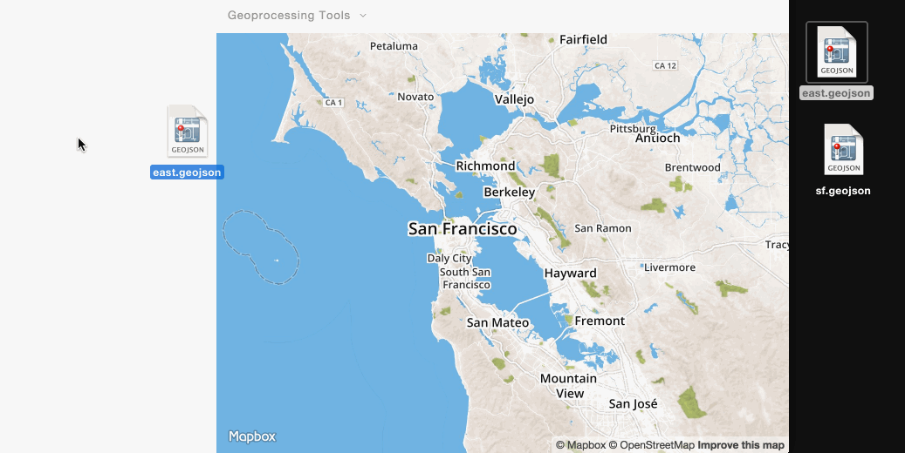

# Drop 'n Chop

**You drop. We chop.**

Drop 'n Chop (DNC) is a browser-based GIS powered by [Leaflet.js](http://leafletjs.com) and [Turf.js](http://turfjs.org). DNC is currently a proof of concept and explores three hypothesis:

### 1. GIS can be data-first, not operation-first.

GIS software is complex. And rightly so! The vast number of spatial operations and analyses make for an incredibly steep point of entry for a user. Without having a single shapefile prepared there are multitudes of buttons and operations available to you. Operations come first. Data is secondary.

Your data should dictate what operations are available. DNC aims to only show what's possible with the data that you've loaded. *If you upload a single polygon you can add a buffer to it. But you can't union it to nothing, so why allow the user to go through the process of setting up a union?*

### 2. GIS doesn't require a server.

By using HTML5 FileReaders and some special Javascripts for processing file types, we are able to read file binaries in the browser. This allows us to bypass a server and load GeoJSON files straight into our map. With this and the advancements of Turf we can run spatial operations and download them in a light-weight manner.

*It's important to recognize that a huge amount of data will probably require a server. But we are talking small things here right now.*

### 3. GIS is open.

Too often do we hear of people moving from proprietary software to open source software only because they "can't afford it any longer" or "their student license ran out." You shouldn't have to be able to afford giant, bulky software to do simple things with **your** data. DNC is a project made by folks who have mumbled the above more times than ~~Arc~~ a GIS crashing in the middle of a project.

# Who?

All of this work is made possible by [CUGOS](http://cugos.org), an open-source geo community based in Seattle.

# Contribute!

1. **Install Grunt**. Working on Drop-n-Chop requires a few tools. We are using [Grunt](http://gruntjs.com/) for our task running and build process. You can install the Grunt CLI with `npm`:`npm install -g grunt-cli`
2. **Clone the repository**. Once that has been installed successfully, you can clone the repository or your own fork and `cd` into the directory. `git clone git@github.com:YOUR-GITHUB-USERNAME/drop-n-chop.git` and `cd drop-n-chop`
3. **Install dependencies** by running `npm install`
4. **Build & serve** the application with `grunt`. This will create a watcher as well that will lint your JS in the `/src` directory. You can access the application at `localhost:8000`. _Note:_ If you'd like to build the minified version of the codebase (as is used in production), use `grunt prod`.

**NOTE:** Things are moving very quickly with DNC right now. We are still continuing to build out and refactor the architecture of the application. If you want to read more about our decision-making process take a look at some of our [meeting notes in the wiki](https://github.com/cugos/drop-n-chop/wiki/Meeting-Notes---04-11-2015).

*Once you drop the chop don't stop.*
