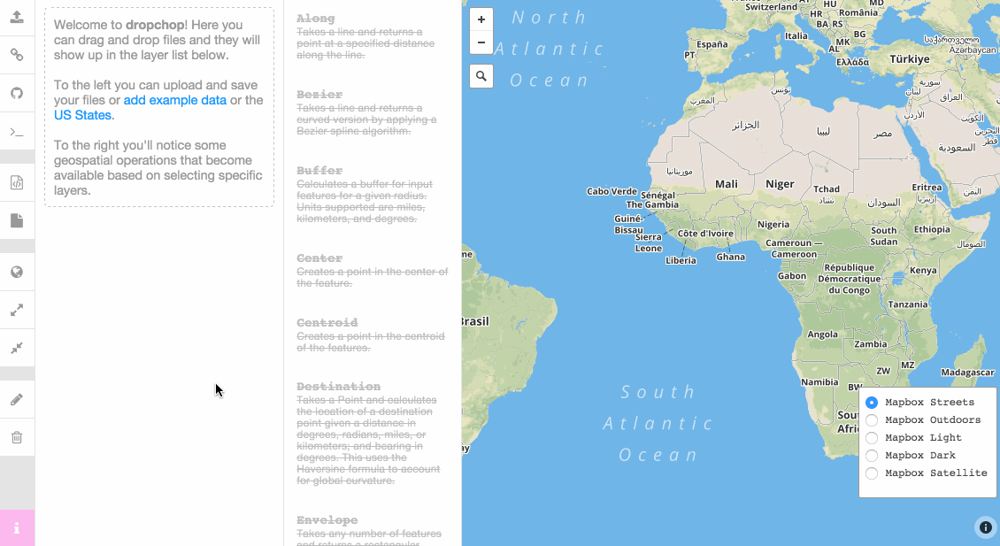

<h1 align="center">
   
  
   
  <a href="http://dropchop.io">dropchop</a>
   
   
</h1>

> **You drop. We chop.**

[![Build Status][travis-image]][travis-url]
[![Codeship Status][codeship-image]][codeship-url]

[travis-image]: https://img.shields.io/travis/cugos/dropchop/master.svg?style=flat-square&label=travis
[travis-url]: https://travis-ci.org/cugos/dropchop
[codeship-image]: https://img.shields.io/codeship/5371c9b0-02a9-0133-3603-2eafb47e949a/master.svg?style=flat-square&label=codeship
[codeship-url]: https://codeship.com/projects/88973

Dropchop is a browser-based GIS powered by [Mapbox.js](http://mapbox.com/mapbox.js) and [Turf.js](http://turfjs.org). The need for small-scale GIS operations comes up quite frequently in our work, especially for those without much time. Dropchop aims to empower your spatial data by removing complexity. This project is currently a proof-of-concept and explores [three hypotheses](https://github.com/cugos/dropchop/wiki/Dropchop-Inspiration):

1. **GIS can be data-first, not operation-first.**
2. **GIS doesn't always require a server.**
3. **GIS is open.**

## User's Manual

Check out the [user manual in the wiki](https://github.com/cugos/dropchop/wiki/User-Manual).

## Who?

All of this work is made possible by [CUGOS](http://cugos.org), an open-source geo community based in Seattle.

## Contribute!

Contributions of all types are very welcome! Information on contributing to Dropchop can be found in the [CONTRIBUTING.md file](CONTRIBUTING.md). Submit ideas as [issues](https://github.com/cugos/dropchop/issues), work on [bugs](https://github.com/cugos/dropchop/labels/bug), add new [features](https://github.com/cugos/dropchop/labels/enhancement). Here's to [our contributors](https://github.com/cugos/dropchop/graphs/contributors)!

## Installation

See [INSTALLATION.md](https://github.com/cugos/dropchop/blob/master/INSTALLATION.md).

## License

[MIT](LICENSE.md)
