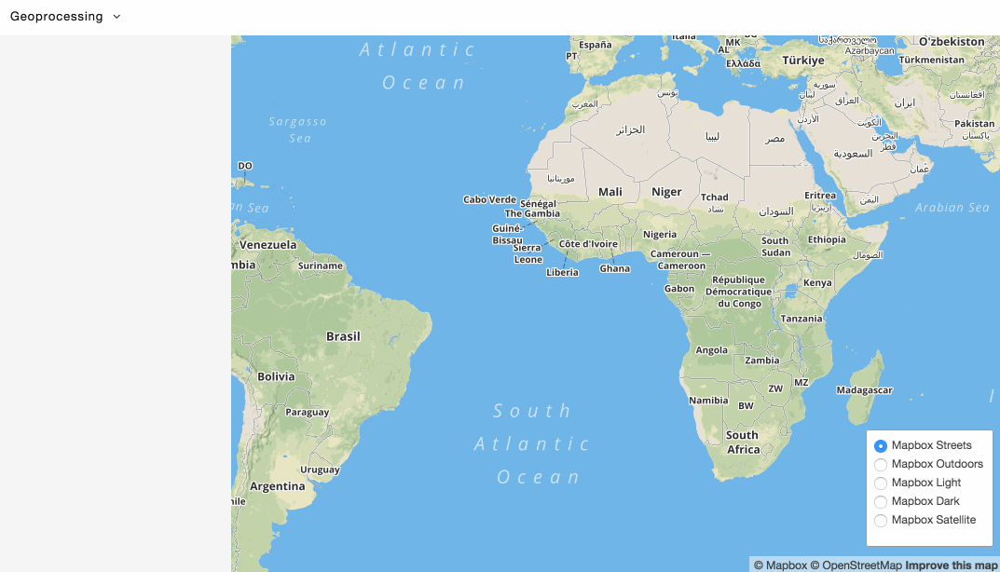

# Dropchop

**You drop. We chop.**

Dropchop is a browser-based GIS powered by [Mapbox.js](http://mapbox.com/mapbox.js) and [Turf.js](http://turfjs.org). The project currently a proof-of-concept and explores [three hypotheses](https://github.com/cugos/dropchop/wiki/Dropchop-Inspiration):

#### 1. GIS can be data-first, not operation-first.
#### 2. GIS doesn't require a server.
#### 3. GIS is open.

# Who?

All of this work is made possible by [CUGOS](http://cugos.org), an open-source geo community based in Seattle.

# Contribute!

[Project installation](https://github.com/cugos/dropchop/wiki/Installing-the-Project) can be found in the wiki.

If you're interested in any of the above, please help out! Submit ideas as [issues](https://github.com/cugos/dropchop/issues), work on [bugs](https://github.com/cugos/dropchop/labels/bug), add new [features](https://github.com/cugos/dropchop/labels/enhancement). Here's to [our contributors](https://github.com/cugos/drop-n-chop/graphs/contributors)!

Things are moving very quickly with the project right now. We are still continuing to build out and refactor the architecture of the application. If you want to read more about our decision-making process take a look at some of our meeting notes. [04/11/2015](https://github.com/cugos/dropchop/wiki/Meeting-Notes---04-11-2015), [05/10/2015](https://github.com/cugos/dropchop/wiki/Meeting-Notes-05-10-2015). 

*Once you drop the chop don't stop.*
